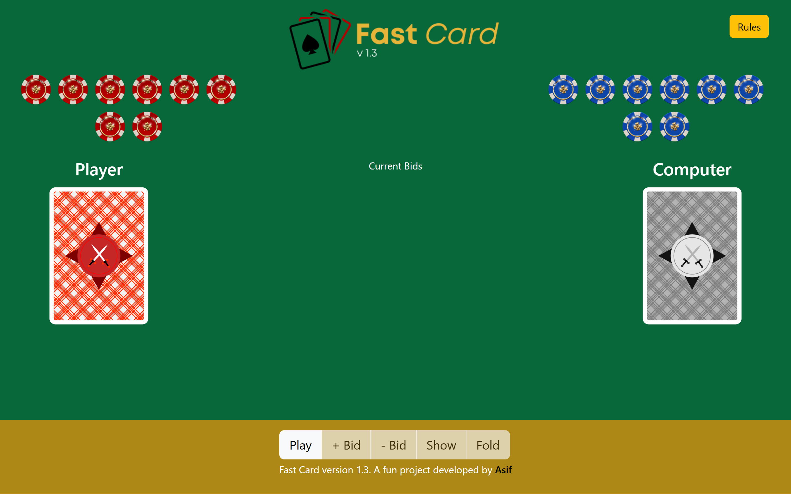
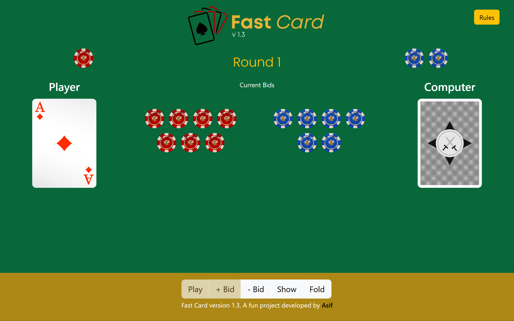
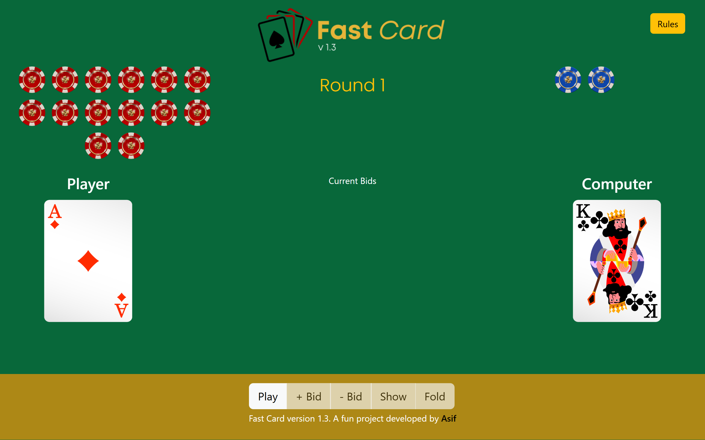
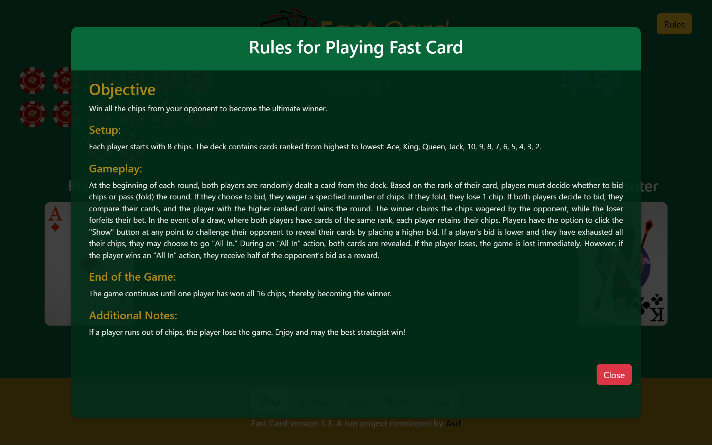

# Fast Card Game 🎴⚡

Welcome to **Fast Card Game**, a fast-paced and strategic browser card game built with **Vue 3**. Challenge a computer opponent, manage your chips carefully, and decide when to **bid, show, fold, or go all-in** to claim victory.

Check it out live 👉 **[Fast Card Game](https://fastcard.netlify.app/)**

---

## ✨ Features

- 🎮 **Interactive Card Game Experience** – Play against a computer opponent in a complete end-to-end gameplay loop.
- 🃏 **Random Card Draws** – Every round deals fresh cards from a standard deck for unpredictable gameplay.
- 💰 **Strategic Bidding System** – Increase, decrease, show, fold, or go all-in depending on your confidence.
- 🤖 **Confidence-Based Opponent Strategy** – The opponent uses confidence-based bidding logic to simulate strategic play.
- 🏆 **Win Condition Tracking** – Battle until one side captures all **16 chips**.
- 📊 **Round Counter & Chip Tracking** – Keep an eye on the flow of the match and remaining chips.
- 📜 **Built-In Rules Modal** – Players can instantly review the game rules without leaving the game screen.
- ⚠️ **Special “Show Anyway” Mechanic** – Adds a fun, high-risk twist when the player is all-in.
- ✨ **Fun Animations & UI Feedback** – Smooth transitions, helpful messages, and a playful card-game atmosphere.

---

## 🕹️ How the Game Works

Fast Card is a simple but strategic chip-based card game:

- Both the **player** and the **computer** begin with **8 chips**.
- At the start of each round, both sides automatically place an initial bid.
- Each side receives a **random card**.
- The player can then:
  - **Increase Bid**
  - **Decrease Bid**
  - **Show**
  - **Fold**
- If both players stay in, the higher-ranked card wins the round and collects the chips.
- If a player folds, they automatically lose chips for that round.
- The game continues until one side collects **all 16 chips**.

This creates a fun mix of **luck, risk-taking, bluffing, and timing**.

---

## 🛠 Tech Stack

- **Vue 3**
- **Vuex 4**
- **HTML5**
- **CSS3**
- **Bootstrap 5**
- **Vue CLI 5**
- **Netlify** (deployment)

---

## 📂 Project Structure

```bash
src/
├── assets/
├── components/
│   ├── cards/
│   │   └── TheCard.vue
│   ├── chips/
│   │   ├── ChipsStock.vue
│   │   └── TheBid.vue
│   ├── header/
│   │   └── TheHeader.vue
│   └── UI/
│       ├── CustomMessage.vue
│       ├── RoundCounter.vue
│       └── ShowRule.vue
├── App.vue
└── main.js
```

---

## 📸 Screenshots

### Game Interface



### Bidding Operation



### Challenge And Win



### Rules



---

## 🚀 Getting Started

Want to run the project locally? Follow these steps:

### 📋 Requirements

- **Node.js** (v16 or later recommended)
- **npm**

### ⏳ Installation

1. **Clone the repository**

   ```sh
   git clone https://github.com/Md-Asifullah/fast-card.git
   cd fast-card
   ```

2. **Install dependencies**

   ```sh
   npm install
   ```

3. **Run the development server**

   ```sh
   npm run serve
   ```

4. Open your browser and visit the local URL shown in the terminal.

### 📦 Build for Production

To create a production build:

```sh
npm run build
```

### ✅ Lint the Project

```sh
npm run lint
```

---

## 📦 Package Info

This project uses:

- **vue** `^3.2.13`
- **vuex** `^4.0.2`
- **core-js** `^3.8.3`
- **@vue/cli-service** `~5.0.0`
- **eslint** `^7.32.0`

---

## 💡 Highlights

This project showcases:

- Front-end game logic implementation
- State-driven UI interactions
- Dynamic chip and bid management
- Component-based Vue architecture
- Confidence-based AI behavior
- Interactive game controls with real-time visual feedback
- Custom gameplay logic for folds, reveals, and all-in scenarios

---

## 🎨 About the Project

**Fast Card Game** was built as a practice project focused on **front-end development, interactivity, and game logic**. It was a fun and challenging experience that helped strengthen skills in building dynamic user interfaces and managing gameplay state with Vue and Vuex.

Although it started as a learning project, it delivers a competitive and entertaining experience for players who enjoy light strategy games with a bit of bluff and risk.

---

## 👨‍💻 Author

Created with ❤️ by **[Md Asifullah](https://artisanasif.com/)**

- **Role:** Front-End Developer & Software Engineer
- **Category:** Front End Development
- **Service:** Frontend Application Development

💼 Want to connect? Let’s talk! 🚀

---

## 🔗 Links

- **Live App:** [https://fastcard.netlify.app/](https://fastcard.netlify.app/)
- **Portfolio:** [https://artisanasif.com/](https://artisanasif.com/)
- **GitHub Repository:** [https://github.com/Md-Asifullah/fast-card`](https://github.com/Md-Asifullah/fast-card)

---

## 📜 License

This project is for **learning, practice, and portfolio purposes**.  
Feel free to explore, fork, and experiment with it.

**Have fun playing Fast Card! 🎉**
